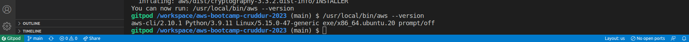
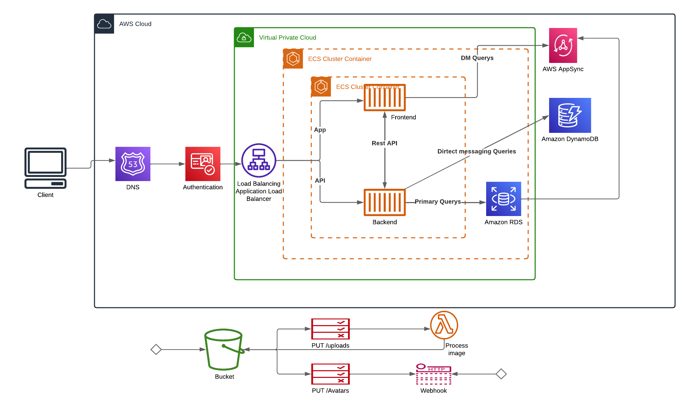
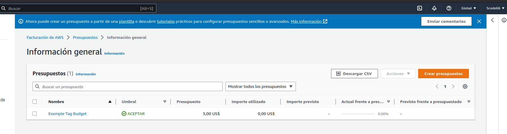
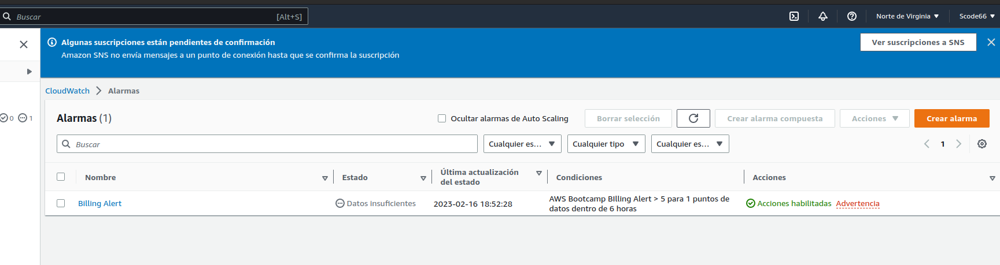

# Week 0 — Billing and Architecture

## Homework/Tasks

### Install and Verify AWS CLI
Use GItPod to install and verify AWS CLI

In that order of ideas I am providing the steps and instructions that I use to configure GitPod

Use the following steps to install AWS CLI

install the AWS CLI for linux via terminal commands;

I followed the instructions on the [AWS CLI Install Documentation Page]
(https://docs.aws.amazon.com/cli/latest/userguide/getting-started-install.html)

```
curl "https://awscli.amazonaws.com/awscli-exe-linux-x86_64.zip" -o "awscliv2.zip"
unzip awscliv2.zip
sudo ./aws/install
```

Do not take screenshots when installing it, because I forgot but I am attaching evidence that it was installed correctly


### Logical Architectual Diagram


[Lucid Charts Share Link](https://lucid.app/lucidchart/88a7e383-ba36-4acd-9304-5066a0ffa2c8/edit?viewport_loc=24%2C31%2C2219%2C1085%2C0_0&invitationId=inv_f8e6c559-42f2-4288-9278-344731afb83c)

### Create a Budget

I created my own Budget for $5 because I can't afford a type of additional expense .
I created a second alarm but immediately deleted it realizing it might cost extra.
It is a tool that I find very useful to keep my finances under control within AWS

 

### Create billing alarms
Adjunto prueba de como configure la alarma siguiendo los pasos enseñados por Chirag Nayyar en su video tutorial

