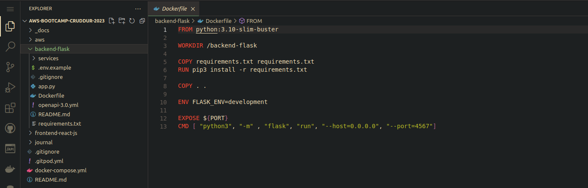
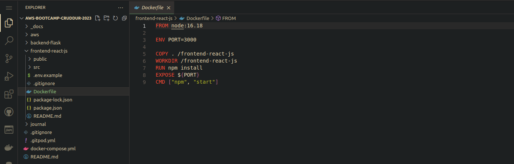
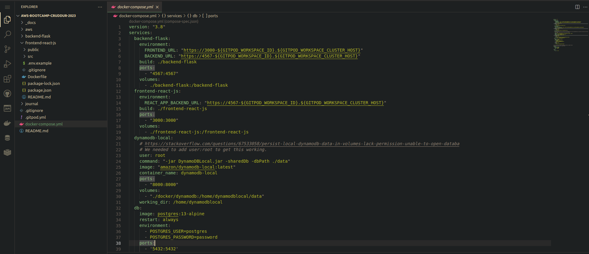
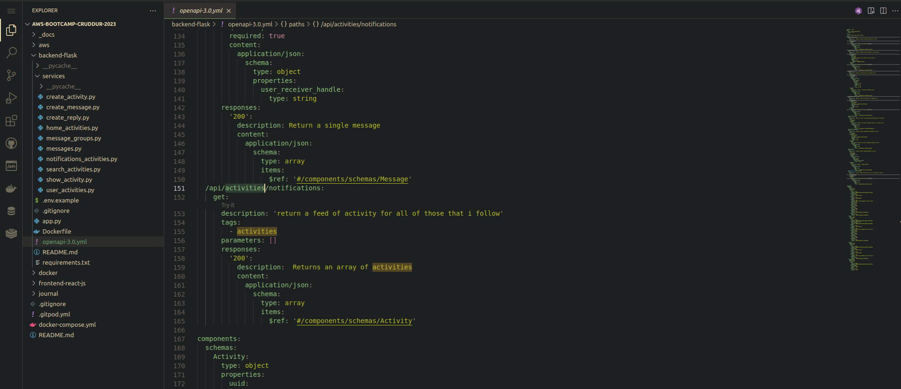
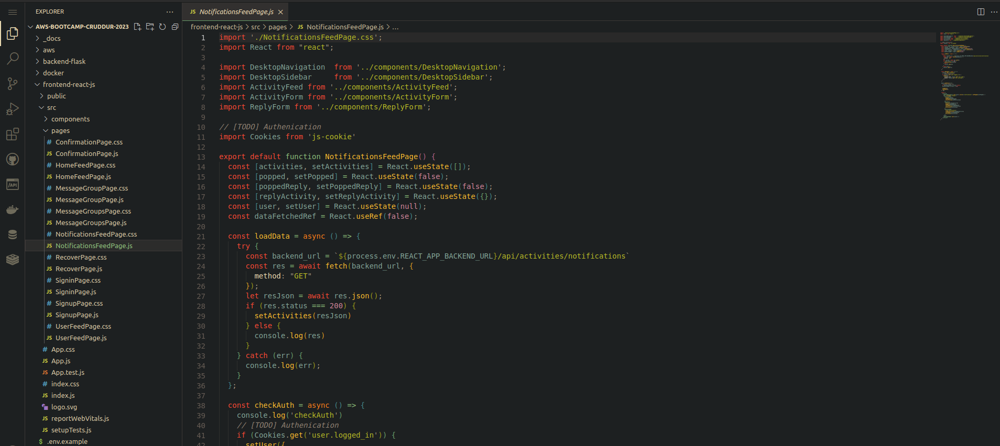
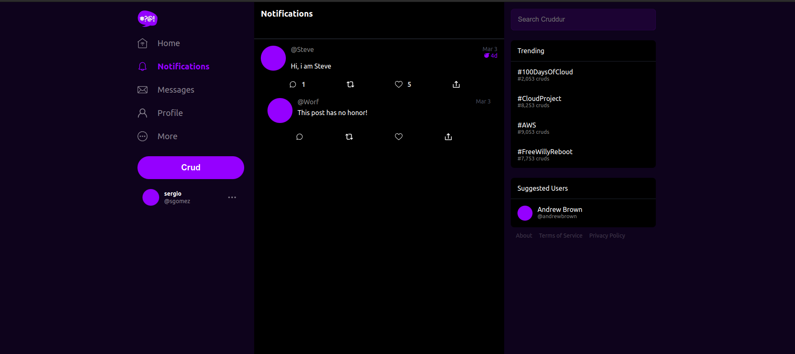
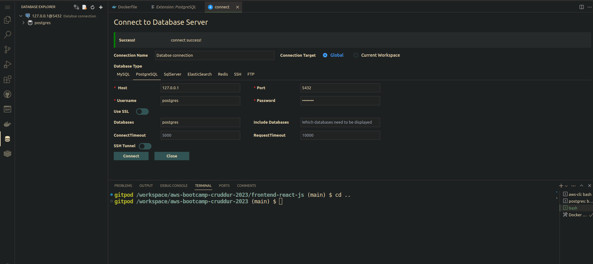

# Week 1 — App Containerization

## Homeworks
## Containerize Backend
### Run python
Yo use los siguientes comandos para correr python
```sh
cd backend-flask
export FRONTEND_URL="*"
export BACKEND_URL="*"
python3 -m flask run --host=0.0.0.0 --port=4567
cd ..
```

### add docker file
Cree el archivo dockerfile donde pegue lo siguiente
Create a file here: `backend-flask/Dockerfile`

```dockerfile
FROM python:3.10-slim-buster

WORKDIR /backend-flask

COPY requirements.txt requirements.txt
RUN pip3 install -r requirements.txt

COPY . .

ENV FLASK_ENV=development

EXPOSE ${PORT}
CMD [ "python3", "-m" , "flask", "run", "--host=0.0.0.0", "--port=4567"]
```


## Run Container
Use el siguiente comando para correr el contenedor
Run in background
```sh
docker container run --rm -p 4567:4567 -d backend-flask
```

## Containerize Frontend

## Run NPM Install

We have to run NPM Install before building the container since it needs to copy the contents of node_modules

```
cd frontend-react-js
npm i
## Containerize Frontend
Cree el archivo dockerfile donde pegue lo siguiente
```
### add docker file
Cree el archivo dockerfile donde pegue lo siguiente

Create a file here: `frontend-react-js/Dockerfile`

```dockerfile
FROM node:16.18

ENV PORT=3000

COPY . /frontend-react-js
WORKDIR /frontend-react-js
RUN npm install
EXPOSE ${PORT}
CMD ["npm", "start"]
```


### Run Container
Use el siguiente comando para correr el contenedor

```sh
docker run -p 3000:3000 -d frontend-react-js
```

## Multiple Containers


### Create a docker-compose file, adding DynamoDB local and Postgres


## I create new notifications backend endpoint


## I update openapi to add notifications


## I implement frontend notifications page


## Correct operation notifications app


## Correct conection database



